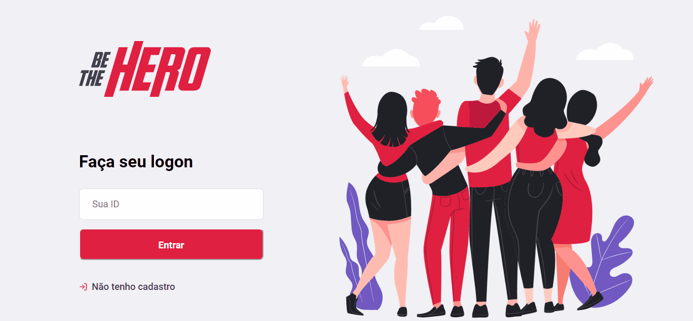

<h1 align='center'>
    
</h1>

<h1 align='center'>
    
</h1>

<!--
# Indice
- [About](#-:pencil2:-about)
- [Techs](#-:robot:-techs)
- [How-to](#-:checkered_flag:-how-to)
-->

---

##  :pencil2: About 

**Be The Hero** is a system to helps **NGO's** to find sponsors. It was created whithin the event **Semana OmniStack11 - RocketSeat's** in order to put into practice all the content studied during the course.


---


##  :robot: Techs

- [ReactJs](https://reactjs.org)
- [ReactNative](https://reactnative.dev)
- [Expo](https://expo.io/)


---


##  :checkered_flag: How-to


```bash

$ git clone https://github.com/fabiopicolijr/be-the-hero

$ cd backend

$ yarn start

$ cd ../frontend

$ yarn start

$ cd ../mobiles

$ expo start
```

---
Developed :sparkles: by @fabiopicolijr.
